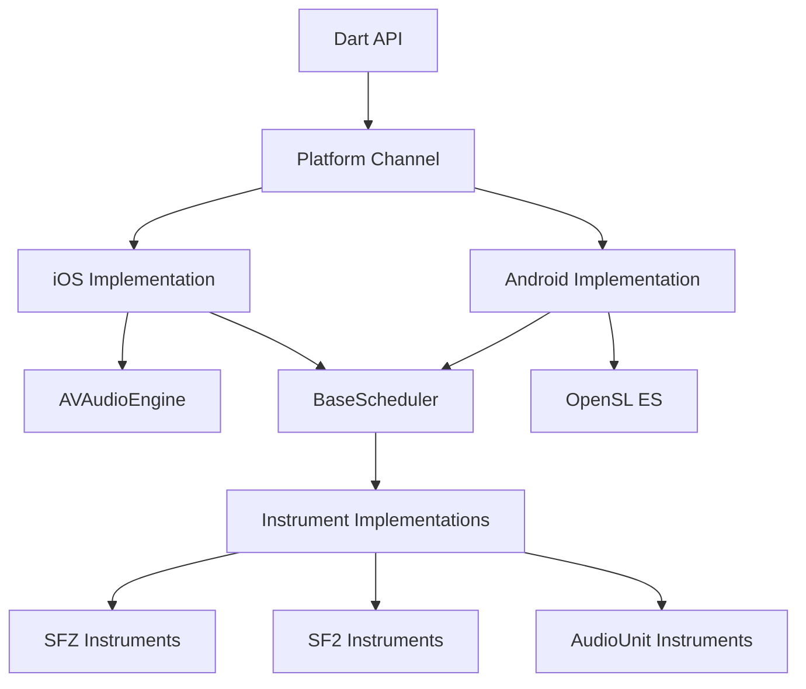
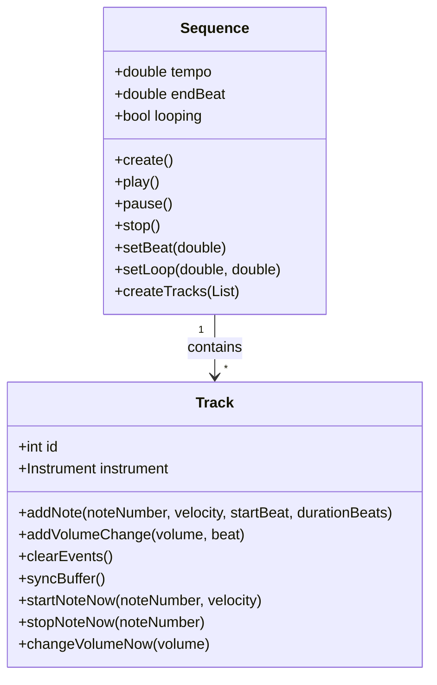
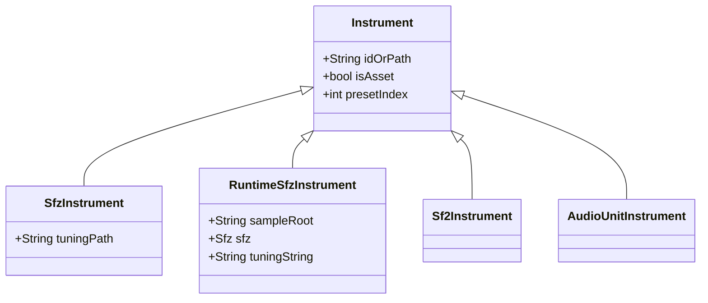
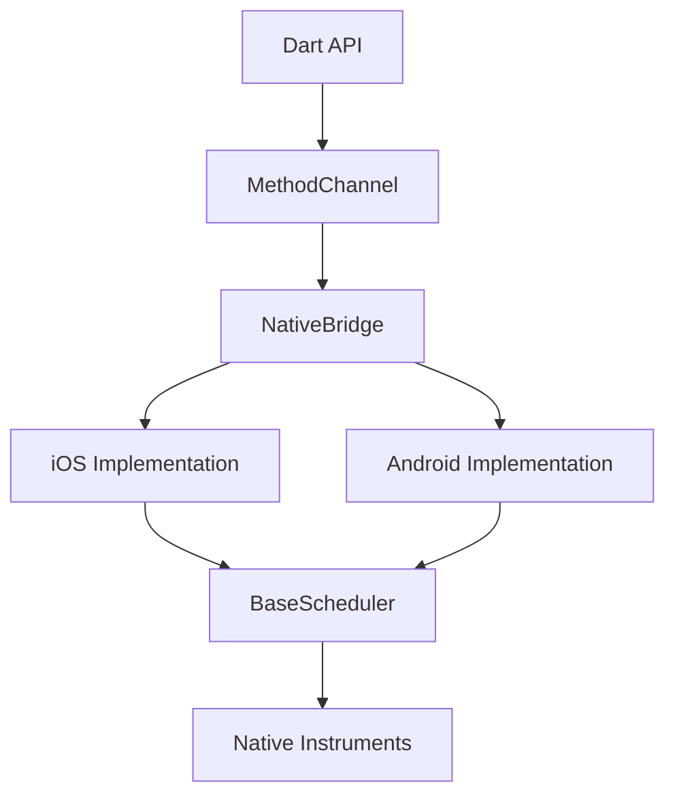
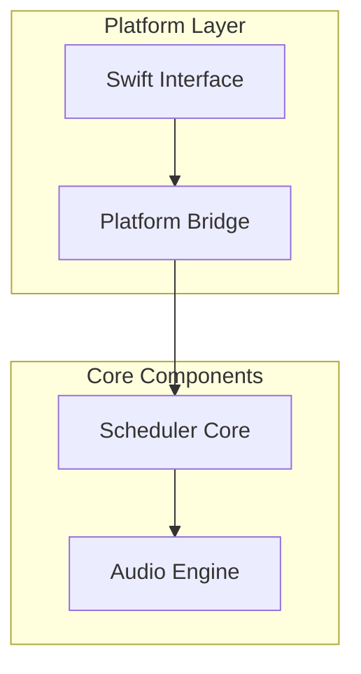

# System Patterns - Flutter Sequencer

This document outlines the key architectural patterns and technical decisions in the Flutter Sequencer project.

## Overall Architecture

Flutter Sequencer follows a cross-platform architecture with platform-specific native implementations:

```
Flutter UI Layer (Dart)
       ↓
Channel/FFI Layer
       ↓
 ┌─────┴─────┐
 ↓           ↓
iOS         Android
Native      Native
Layer       Layer
```

### Components and Responsibilities

1. **Flutter UI Layer**
   - Manages sequences, tracks, and scheduling
   - Handles user interaction and visual feedback
   - Communicates with native layer through channels/FFI

2. **Channel/FFI Layer**
   - Provides platform abstraction
   - Converts between Dart and native types
   - Handles method calls and callbacks

3. **iOS Native Layer**
   - Uses AVAudioEngine and AudioUnits
   - Manages audio session and lifecycle
   - Implements sound font loading and playback

4. **Android Native Layer**
   - Uses OpenSL ES or Oboe for audio output
   - Manages native audio engine lifecycle
   - Implements JNI bridge to C++ audio engine

## C API Bridge Architecture

The plugin uses a clean C API bridge to interface between Swift and C++ code:

```
Swift Code
    ↓
C API Bridge (EngineBindings.h/EngineBindings.cpp)
    ↓
C++ Engine Implementation
```

### Key Components:

1. **EngineBindings.h**
   - Declares all public C functions with proper types
   - Defines opaque pointer types for handles
   - Provides struct and enum definitions for data exchange
   - Declares the external Dart_PostCObject_DL variable

2. **EngineBindings.cpp**
   - Implements the bridge functions that forward calls to the C++ engine
   - Handles type conversions and memory management
   - Implements proper casting between opaque and void pointers

3. **Module Integration**
   - Uses `module.modulemap` to expose C functions to Swift
   - Swift code imports the module with `@_implementationOnly import flutter_sequencer`
   - Handles symbol visibility and linkage

### Opaque Pointer Pattern

For type safety and encapsulation, the bridge uses opaque pointers:

```c
// Forward declare opaque pointer handle types
typedef struct EngineHandle* EnginePtr;
typedef struct SchedulerHandle* SchedulerPtr;
```

These types provide compile-time type checking while hiding implementation details.

## Demo Mode vs Production Mode

The plugin supports two operating modes:

### Demo Mode
- Uses stub libraries with identical API but no actual audio processing
- Enables UI development without native library dependencies
- Returns mock data for all method calls

### Production Mode
- Uses fully implemented native libraries
- Performs real audio processing and output
- Required for release builds

Mode selection is done at build time through:
- Android: buildConfigField in build.gradle
- iOS: Always attempts to use production mode

## Event Scheduling System

Audio events are scheduled through a buffer system:

```
Dart Layer (Sequence/Track) → Native Scheduler → Backend Audio Processor
```

Events include:
- Note on/off
- Volume changes
- MIDI CC events
- Pitch bend

The scheduler operates on a frame-based timeline rather than real-time, ensuring accurate timing regardless of processing delays.

## Platform-Specific Implementations

### iOS Specific Patterns

1. **AVAudioEngine Graph**
   - Uses nodes and connections for audio processing
   - Integrates with AudioUnit system for instruments

2. **Swift/C++ Interoperability**
   - Uses C API bridge for all C++ engine access
   - Follows Apple's recommended patterns for bridging
   - Maintains clear separation between Swift and C++ code

3. **Module System Integration**
   - Uses `module.modulemap` to define module structure
   - Specifies umbrella headers and exports
   - Enables proper symbol visibility and import

### Android Specific Patterns

1. **JNI Bridge**
   - Connects Java/Kotlin with C++ engine
   - Handles method registration and parameter passing

2. **Native Activity Lifecycle**
   - Synchronizes audio engine with app lifecycle
   - Manages resource allocation and deallocation

## Asset Management

Asset handling differs between platforms:

1. **iOS**
   - Assets are accessed directly from bundle
   - Paths need normalization for correct access

2. **Android**
   - Assets extracted to app files directory
   - File system paths used for loading

## Thread Safety and Concurrency

1. **Audio Thread**
   - Real-time priority thread for audio processing
   - Avoids blocking operations and memory allocation
   - Uses lock-free algorithms where possible

2. **UI Thread**
   - Handles user interaction and UI updates
   - Communicates with audio thread through message passing

3. **Buffer System**
   - Thread-safe for one reader and one writer
   - Uses atomic operations for synchronization
   - Designed to be real-time safe

## Error Handling and Recovery

1. **Layered Error Propagation**
   - Native errors converted to platform-specific types
   - Channel errors translated to Dart exceptions
   - Consistent error codes across platforms

2. **Graceful Degradation**
   - Falls back to demo mode if native libraries fail to load
   - Provides meaningful error messages for troubleshooting

## Memory Management

1. **Native Resources**
   - Explicit lifecycle management for native resources
   - Clear ownership rules for allocated memory
   - Proper cleanup in destructors and finalizers

2. **Buffer Management**
   - Fixed-size buffers to avoid runtime allocation
   - Periodic buffer top-off for continuous playback

## Callbacks and Event Propagation

1. **Native to Dart Callbacks**
   - Uses Dart_PostCObject mechanism for efficient callbacks
   - Sends primitive data types and arrays to Dart
   - Registers callback ports for different event types

2. **Lifecycle Events**
   - Propagates app lifecycle events to audio engine
   - Handles interruptions (calls, notifications) gracefully

## System Architecture

The flutter_sequencer plugin follows a layered architecture that separates concerns between the Dart API layer and the native platform implementations:



### Core Components

1. **Sequence**: The main class that manages playback, tempo, and looping. Acts as a container for Tracks.
2. **Track**: Represents a single instrument track in the sequence, holding notes and automation events.
3. **BaseScheduler**: The C++ core that schedules and processes audio events.
4. **Buffer**: Stores scheduled events for each track.
5. **Instrument**: Abstract base class for different instrument types.
6. **NativeBridge**: Handles communication between Dart and native code.

## Key Technical Decisions

### 1. Platform-Specific Audio Implementations

The plugin uses platform-specific audio engines:
- **iOS**: AVAudioEngine with AudioUnit nodes
- **Android**: OpenSL ES with a custom rendering implementation

This decision ensures optimal performance on each platform while maintaining a consistent API.

### 2. Shared C++ Core

The BaseScheduler and core event processing logic is implemented in C++ and shared between platforms to:
- Reduce code duplication
- Ensure consistent behavior
- Leverage C++'s performance for audio processing

### 3. Instrument Abstraction

A unified Instrument interface with platform-specific implementations:
- **SfzInstrument**: Uses sfizz for SFZ format support
- **Sf2Instrument**: Uses platform-specific SoundFont implementations
- **AudioUnitInstrument**: iOS-specific for AudioUnit support

### 4. Event Buffer System

The event buffer system:
- Stores events in a thread-safe buffer
- Uses frame-based timing for precise audio scheduling
- Periodically "tops off" buffers to handle looping and long sequences

## Design Patterns

### 1. Factory Pattern

Used for creating platform-specific implementations:
- `Sequence.createTracks()` creates platform-specific Track instances
- Each Track uses a factory approach to create appropriate Instrument instances

### 2. Observer Pattern

Used for monitoring sequence state:
- Sequences notify their tracks about tempo changes
- Position updates are polled rather than pushed for performance reasons

### 3. Bridge Pattern

Used to separate abstraction from implementation:
- The Dart API defines the abstraction
- Platform-specific code provides implementations

### 4. Builder Pattern

Used for constructing complex objects:
- `Sfz` class uses a builder pattern for constructing SFZ definitions
- `RuntimeSfzInstrument` uses this to create instruments dynamically

## Component Relationships

### Sequence and Track Relationship



### Instrument Hierarchy



### Native Bridge Pattern



## Implementation Details

### Thread Management

The plugin uses multiple threads for different responsibilities:
1. **Main Thread**: UI updates and non-time-critical operations
2. **Audio Thread**: Real-time audio processing and rendering
3. **Load Thread**: Loading samples and instruments

### Event Scheduling

Events are scheduled based on beats but converted to sample frames for precise timing:
1. **Position Calculation**: `frame = (beat / tempo) * 60 * sampleRate`
2. **Buffer Management**: Events are stored in a fixed-size buffer
3. **Top-Off Mechanism**: Periodically refills buffers with upcoming events

### Memory Management

Careful memory management is implemented to avoid audio glitches:
1. **Pre-allocation**: Buffers are pre-allocated to avoid real-time allocations
2. **Resource Cleanup**: Instruments properly release resources on destruction
3. **Reference Counting**: Platform-specific resources use appropriate lifetime management

## System Architecture and Patterns

## Core Architecture

### Module Organization
- Umbrella header pattern for public API exposure
- Clear separation between public and private headers
- Modular organization of components:
  - Core scheduling (`Scheduler.h/cpp`)
  - Audio engine integration
  - Platform-specific bridges
  - Swift interface layer

### Interoperability Patterns
- C-style interface for core functionality
- C++ implementation details hidden from Swift
- Debug logging infrastructure for development
- Error handling through return codes
- Memory management through explicit ownership

### Component Relationships


## Technical Decisions
1. Build System
   - CocoaPods for dependency management
   - Modular header organization
   - Architecture-specific optimizations

2. Error Handling
   - Return codes for C interface
   - Error propagation through layers
   - Debug logging for development

3. Memory Management
   - Clear ownership rules
   - RAII in C++ implementation
   - Reference counting in Swift

4. Threading Model
   - Main thread for UI operations
   - Dedicated thread for scheduler
   - Lock-free operations where possible

## Evolution Strategy
### Short Term
- Complete minimal scheduler implementation
- Establish testing infrastructure
- Integrate with audio engine

### Medium Term
- Optimize performance
- Enhance error handling
- Improve debugging tools

### Long Term
- Add advanced scheduling features
- Support for complex event patterns
- Real-time performance analysis

## Current Focus Areas

### iOS Build System
1. Module organization improvements
2. Build script enhancements
3. Architecture support updates

### Swift Integration
1. Simplified interoperability
2. Clear type boundaries
3. Efficient marshaling

## Evolution Strategy

### Short Term
1. Complete module organization
2. Verify architecture support
3. Update build system

### Medium Term
1. Optimize performance
2. Enhance error handling
3. Improve documentation

### Long Term
1. Add advanced features
2. Expand platform support
3. Enhance user experience 