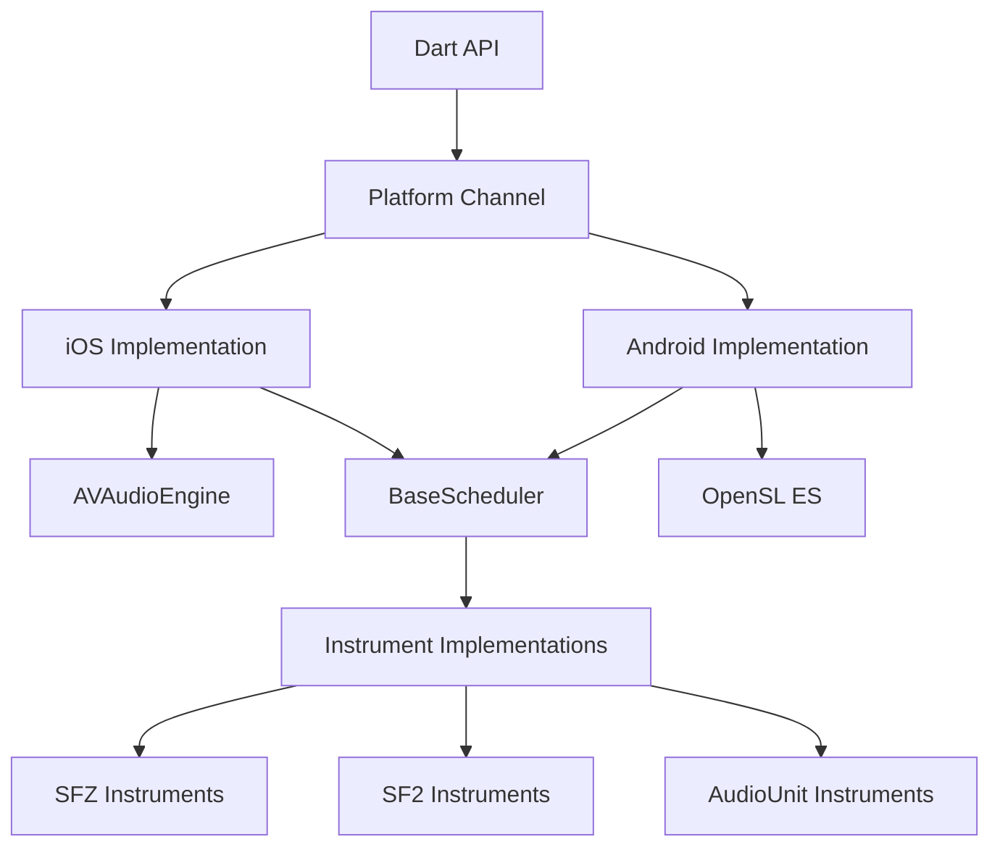
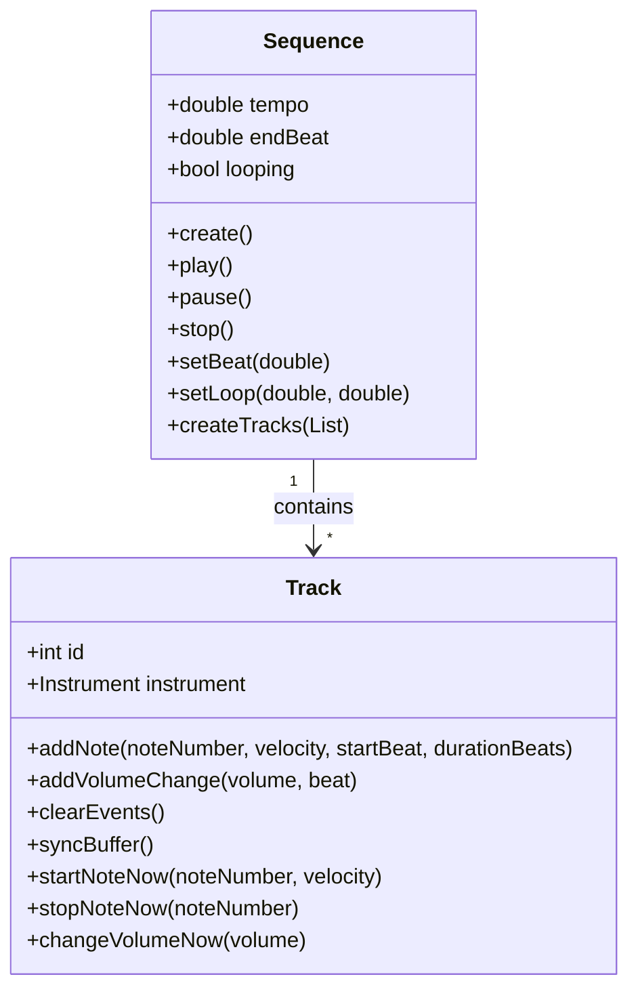
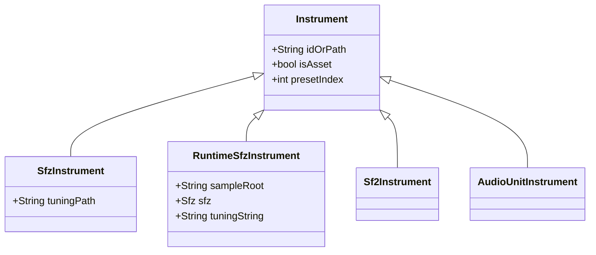
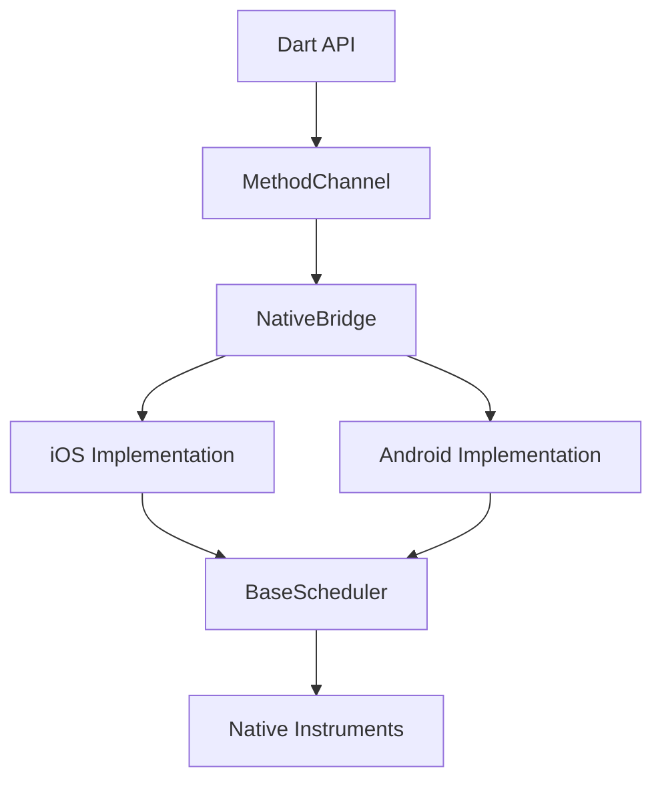

# System Patterns

## System Architecture

The flutter_sequencer plugin follows a layered architecture that separates concerns between the Dart API layer and the native platform implementations:

```mermaid
graph TD
    A[Dart API] --> B[Platform Channel]
    B --> C1[iOS Implementation]
    B --> C2[Android Implementation]
    C1 --> D1[AVAudioEngine]
    C1 --> D3[BaseScheduler]
    C2 --> D2[OpenSL ES]
    C2 --> D3
    D3 --> E[Instrument Implementations]
    E --> F1[SFZ Instruments]
    E --> F2[SF2 Instruments]
    E --> F3[AudioUnit Instruments]
```

### Core Components

1. **Sequence**: The main class that manages playback, tempo, and looping. Acts as a container for Tracks.
2. **Track**: Represents a single instrument track in the sequence, holding notes and automation events.
3. **BaseScheduler**: The C++ core that schedules and processes audio events.
4. **Buffer**: Stores scheduled events for each track.
5. **Instrument**: Abstract base class for different instrument types.
6. **NativeBridge**: Handles communication between Dart and native code.

## Key Technical Decisions

### 1. Platform-Specific Audio Implementations

The plugin uses platform-specific audio engines:
- **iOS**: AVAudioEngine with AudioUnit nodes
- **Android**: OpenSL ES with a custom rendering implementation

This decision ensures optimal performance on each platform while maintaining a consistent API.

### 2. Shared C++ Core

The BaseScheduler and core event processing logic is implemented in C++ and shared between platforms to:
- Reduce code duplication
- Ensure consistent behavior
- Leverage C++'s performance for audio processing

### 3. Instrument Abstraction

A unified Instrument interface with platform-specific implementations:
- **SfzInstrument**: Uses sfizz for SFZ format support
- **Sf2Instrument**: Uses platform-specific SoundFont implementations
- **AudioUnitInstrument**: iOS-specific for AudioUnit support

### 4. Event Buffer System

The event buffer system:
- Stores events in a thread-safe buffer
- Uses frame-based timing for precise audio scheduling
- Periodically "tops off" buffers to handle looping and long sequences

## Design Patterns

### 1. Factory Pattern

Used for creating platform-specific implementations:
- `Sequence.createTracks()` creates platform-specific Track instances
- Each Track uses a factory approach to create appropriate Instrument instances

### 2. Observer Pattern

Used for monitoring sequence state:
- Sequences notify their tracks about tempo changes
- Position updates are polled rather than pushed for performance reasons

### 3. Bridge Pattern

Used to separate abstraction from implementation:
- The Dart API defines the abstraction
- Platform-specific code provides implementations

### 4. Builder Pattern

Used for constructing complex objects:
- `Sfz` class uses a builder pattern for constructing SFZ definitions
- `RuntimeSfzInstrument` uses this to create instruments dynamically

## Component Relationships

### Sequence and Track Relationship

```mermaid
classDiagram
    class Sequence {
        +double tempo
        +double endBeat
        +bool looping
        +create()
        +play()
        +pause()
        +stop()
        +setBeat(double)
        +setLoop(double, double)
        +createTracks(List<Instrument>)
    }
    
    class Track {
        +int id
        +Instrument instrument
        +addNote(noteNumber, velocity, startBeat, durationBeats)
        +addVolumeChange(volume, beat)
        +clearEvents()
        +syncBuffer()
        +startNoteNow(noteNumber, velocity)
        +stopNoteNow(noteNumber)
        +changeVolumeNow(volume)
    }
    
    Sequence "1" --> "*" Track : contains
```

### Instrument Hierarchy

```mermaid
classDiagram
    class Instrument {
        +String idOrPath
        +bool isAsset
        +int presetIndex
    }
    
    class SfzInstrument {
        +String tuningPath
    }
    
    class RuntimeSfzInstrument {
        +String sampleRoot
        +Sfz sfz
        +String tuningString
    }
    
    class Sf2Instrument {
    }
    
    class AudioUnitInstrument {
    }
    
    Instrument <|-- SfzInstrument
    Instrument <|-- RuntimeSfzInstrument
    Instrument <|-- Sf2Instrument
    Instrument <|-- AudioUnitInstrument
```

### Native Bridge Pattern

```mermaid
graph TD
    A[Dart API] --> B[MethodChannel]
    B --> C[NativeBridge]
    C --> D1[iOS Implementation]
    C --> D2[Android Implementation]
    D1 --> E1[BaseScheduler]
    D2 --> E1
    E1 --> F[Native Instruments]
```

## Implementation Details

### Thread Management

The plugin uses multiple threads for different responsibilities:
1. **Main Thread**: UI updates and non-time-critical operations
2. **Audio Thread**: Real-time audio processing and rendering
3. **Load Thread**: Loading samples and instruments

### Event Scheduling

Events are scheduled based on beats but converted to sample frames for precise timing:
1. **Position Calculation**: `frame = (beat / tempo) * 60 * sampleRate`
2. **Buffer Management**: Events are stored in a fixed-size buffer
3. **Top-Off Mechanism**: Periodically refills buffers with upcoming events

### Memory Management

Careful memory management is implemented to avoid audio glitches:
1. **Pre-allocation**: Buffers are pre-allocated to avoid real-time allocations
2. **Resource Cleanup**: Instruments properly release resources on destruction
3. **Reference Counting**: Platform-specific resources use appropriate lifetime management 